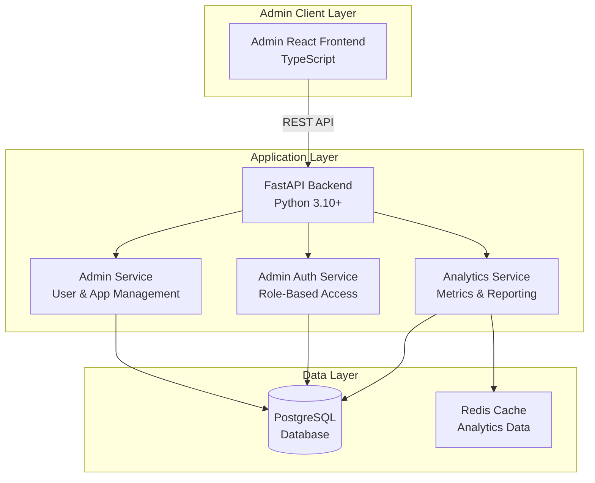

<!-- # Design Document: Admin Panel -->

## Overview

The Admin Panel is a comprehensive management interface for the AI credit scoring system that enables administrators to manage users, review and update application statuses, and monitor system analytics. The panel provides three core capabilities: (1) complete admin user creation and management with role-based access control, (2) application status management with the ability to view, update, approve, and reject credit applications, and (3) an analytics dashboard displaying system metrics including application volumes, approval rates, credit score distributions, and risk category breakdowns. The admin panel integrates with the existing FastAPI backend and uses React/TypeScript for the frontend, following the same authentication and authorization patterns as the main application.

## Architecture



## Components and Interfaces

### Component 1: Admin Authentication Service

**Purpose**: Handles admin user authentication, role verification, and admin-specific JWT token generation with elevated permissions.

**Interface**:
```python
from typing import Optional, List
from pydantic import BaseModel, EmailStr
from datetime import datetime

class AdminLogin(BaseModel):
    email: EmailStr
    password: str

class AdminTokenResponse(BaseModel):
    access_token: str
    token_type: str = "bearer"
    admin_id: int
    email: str
    role: str
    permissions: List[str]

class AdminAuthService:
    def authenticate_admin(self, credentials: AdminLogin) -> AdminTokenResponse:
        """Authenticate admin user and return JWT token with admin scope"""
        pass
    
    def verify_admin_token(self, token: str) -> Optional[dict]:
        """Verify JWT token and validate admin role"""
        pass
    
    def check_permission(self, admin_id: int, permission: str) -> bool:
        """Check if admin has specific permission"""
        pass
```

**Responsibilities**:
- Admin user authentication with email/password
- Role verification (admin vs super_admin)
- JWT token generation with admin scope
- Permission checking for specific operations

### Component 2: Admin Service

**Purpose**: Manages admin operations including user management, application status updates, and audit logging.

**Interface**:
```python
from typing import List, Optional
from pydantic import BaseModel, EmailStr, Field
from datetime import datetime
from enum import Enum

class AdminRole(str, Enum):
    ADMIN = "admin"
    SUPER_ADMIN = "super_admin"

class AdminUserCreate(BaseModel):
    email: EmailStr
    password: str = Field(..., min_length=8)
    full_name: str
    role: AdminRole = AdminRole.ADMIN
    permissions: List[str] = []

class ApplicationStatusUpdate(BaseModel):
    status: str
    notes: Optional[str] = None
    reason: Optional[str] = None

class AdminService:
    def create_admin_user(self, admin_data: AdminUserCreate) -> dict:
        """Create new admin user with specified role and permissions"""
        pass
    
    def update_application_status(
        self,
        application_id: int,
        status_update: ApplicationStatusUpdate,
        admin_id: int
    ) -> dict:
        """Update application status with audit logging"""
        pass
    
    def list_all_applications(
        self,
        skip: int = 0,
        limit: int = 100,
        status_filter: Optional[str] = None
    ) -> List[dict]:
        """List all applications with optional filtering"""
        pass
    
    def get_audit_log(
        self,
        skip: int = 0,
        limit: int = 100
    ) -> List[dict]:
        """Get audit log of admin actions"""
        pass
```

**Responsibilities**:
- Admin user creation and management
- Application status update with validation
- Audit logging of all admin actions
- Application filtering and retrieval

### Component 3: Analytics Service

**Purpose**: Computes and caches system analytics including application metrics, approval rates, and credit score distributions.

**Interface**:
```python
from typing import Dict, List
from pydantic import BaseModel
from datetime import datetime

class DashboardMetrics(BaseModel):
    timestamp: datetime
    total_applications: int
    approval_rate: float
    average_credit_score: float
    risk_distribution: Dict[str, int]

class AnalyticsService:
    def get_dashboard_metrics(self, days: int = 30) -> DashboardMetrics:
        """Get aggregated dashboard metrics for specified period"""
        pass
    
    def get_credit_score_distribution(self, days: int = 30) -> List[Dict]:
        """Get credit score distribution across ranges"""
        pass
    
    def invalidate_cache(self) -> None:
        """Invalidate analytics cache to force refresh"""
        pass
```

**Responsibilities**:
- Compute application status metrics
- Calculate credit score distributions
- Generate risk category breakdowns
- Cache metrics with TTL for performance

## Data Models

### Model 1: AdminUser

```python
class AdminUser(BaseModel):
    admin_id: int
    email: EmailStr
    full_name: str
    role: str
    permissions: List[str]
    is_active: bool
    created_at: datetime
    updated_at: datetime
```

**Validation Rules**:
- Email must be valid format and unique
- Role must be either "admin" or "super_admin"
- Password must be at least 8 characters
- Permissions list must contain valid permission strings

### Model 2: AuditLog

```python
class AuditLog(BaseModel):
    id: int
    admin_id: int
    action: str
    resource_type: str
    resource_id: int
    old_value: Optional[dict]
    new_value: Optional[dict]
    timestamp: datetime
```

**Validation Rules**:
- admin_id must reference valid AdminUser
- action must be one of: "update_status", "create_admin", "delete_admin"
- resource_type must be one of: "application", "admin_user"
- resource_id must be positive integer

### Model 3: ApplicationStatusUpdate

```python
class ApplicationStatusUpdate(BaseModel):
    status: str
    notes: Optional[str] = None
    reason: Optional[str] = None
```

**Validation Rules**:
- status must be one of: "pending", "approved", "rejected", "under_review"
- notes must not exceed 500 characters
- reason must not exceed 500 characters


## Algorithmic Pseudocode

### Main Algorithm: Admin Application Status Update

```python
def update_application_status(
    application_id: int,
    status_update: ApplicationStatusUpdate,
    admin_id: int
) -> dict:
    """
    Update application status with validation and audit logging.
    
    INPUT: application_id, status_update, admin_id
    OUTPUT: Updated application record with audit log entry
    """
    # Preconditions
    assert application_id > 0
    assert admin_id > 0
    assert status_update.status in ["pending", "approved", "rejected", "under_review"]
    
    # Step 1: Verify admin exists and is active
    admin = db.query(AdminUser).filter(AdminUser.id == admin_id).first()
    assert admin is not None and admin.is_active
    
    # Step 2: Query application from database
    application = db.query(Application).filter(Application.id == application_id).first()
    if application is None:
        raise HTTPException(status_code=404, detail="Application not found")
    
    # Step 3: Validate status transition
    valid_transitions = {
        "pending": ["approved", "rejected", "under_review"],
        "under_review": ["approved", "rejected"],
        "approved": [],
        "rejected": []
    }
    
    if status_update.status not in valid_transitions.get(application.status, []):
        raise HTTPException(status_code=400, detail="Invalid status transition")
    
    # Step 4: Store old value for audit log
    old_value = {"status": application.status}
    
    # Step 5: Update application status
    application.status = status_update.status
    application.updated_at = datetime.utcnow()
    
    # Step 6: Create audit log entry
    audit_log = AuditLog(
        admin_id=admin_id,
        action="update_status",
        resource_type="application",
        resource_id=application_id,
        old_value=old_value,
        new_value={"status": status_update.status},
        timestamp=datetime.utcnow()
    )
    
    # Step 7: Commit transaction
    db.add(audit_log)
    db.commit()
    
    # Postconditions
    assert application.status == status_update.status
    assert audit_log.id > 0
    
    return {"application_id": application.id, "status": application.status}
```

**Preconditions:**
- application_id corresponds to existing application
- admin_id corresponds to active admin user
- status_update contains valid status value
- Database connection is active

**Postconditions:**
- Application status updated in database
- Audit log entry created with before/after values
- Transaction committed successfully

**Loop Invariants:**
- Application ID remains valid throughout process
- Admin user remains active
- Status transition is valid

### Analytics Aggregation Algorithm

```python
def compute_dashboard_metrics(days: int = 30) -> DashboardMetrics:
    """
    Compute aggregated dashboard metrics for specified period.
    
    INPUT: days (number of days to include in metrics)
    OUTPUT: DashboardMetrics with all aggregated data
    """
    # Preconditions
    assert days > 0 and days <= 365
    
    # Step 1: Calculate date range
    end_date = datetime.utcnow()
    start_date = end_date - timedelta(days=days)
    
    # Step 2: Query applications in date range
    applications = db.query(Application).filter(
        Application.created_at >= start_date,
        Application.created_at <= end_date
    ).all()
    
    # Step 3: Count applications by status
    status_counts = {
        "pending": 0,
        "approved": 0,
        "rejected": 0,
        "under_review": 0
    }
    
    for app in applications:
        status_counts[app.status] += 1
    
    # Step 4: Calculate approval rate
    total_apps = len(applications)
    approval_rate = (status_counts["approved"] / total_apps * 100) if total_apps > 0 else 0.0
    
    # Step 5: Query credit scores for distribution
    credit_scores = db.query(CreditScore).join(Application).filter(
        Application.created_at >= start_date,
        Application.created_at <= end_date
    ).all()
    
    # Step 6: Compute credit score distribution
    score_ranges = [(300, 400), (400, 500), (500, 600), (600, 700), (700, 800), (800, 850)]
    score_distribution = {}
    
    for min_score, max_score in score_ranges:
        count = sum(1 for cs in credit_scores if min_score <= cs.credit_score < max_score)
        score_distribution[f"{min_score}-{max_score}"] = count
    
    # Step 7: Compute risk category metrics
    risk_distribution = {
        "low": sum(1 for cs in credit_scores if cs.risk_category == "low"),
        "medium": sum(1 for cs in credit_scores if cs.risk_category == "medium"),
        "high": sum(1 for cs in credit_scores if cs.risk_category == "high")
    }
    
    # Step 8: Calculate average credit score
    if credit_scores:
        average_score = sum(cs.credit_score for cs in credit_scores) / len(credit_scores)
    else:
        average_score = 0.0
    
    # Postconditions
    assert 0 <= approval_rate <= 100
    assert 300 <= average_score <= 850 or average_score == 0.0
    
    return DashboardMetrics(
        timestamp=datetime.utcnow(),
        total_applications=total_apps,
        approval_rate=approval_rate,
        average_credit_score=average_score,
        risk_distribution=risk_distribution
    )
```

**Preconditions:**
- days is positive integer between 1 and 365
- Database connection is active

**Postconditions:**
- All metrics are computed and valid
- Percentages are between 0 and 100
- Credit scores are within valid range

**Loop Invariants:**
- Application counts remain consistent
- Status counts sum to total applications
- Risk category counts sum to total credit scores

## Key Functions with Formal Specifications

### Function 1: create_admin_user()

```python
async def create_admin_user(
    admin_data: AdminUserCreate,
    current_admin: AdminUser = Depends(get_current_admin),
    db: Session = Depends(get_db)
) -> dict:
    """Create new admin user with specified role and permissions"""
    pass
```

**Preconditions:**
- current_admin is authenticated and has super_admin role
- admin_data passes Pydantic validation
- admin_data.email is unique
- admin_data.password is at least 8 characters
- Database session is active

**Postconditions:**
- AdminUser record created in database with unique ID
- Password hashed using bcrypt
- Returns AdminUserResponse with all fields populated
- Database transaction committed successfully

**Loop Invariants:** N/A

### Function 2: update_application_status()

```python
async def update_application_status(
    application_id: int,
    status_update: ApplicationStatusUpdate,
    current_admin: AdminUser = Depends(get_current_admin),
    db: Session = Depends(get_db)
) -> dict:
    """Update application status with audit logging"""
    pass
```

**Preconditions:**
- current_admin is authenticated and has admin role
- application_id corresponds to existing application
- status_update contains valid status value
- Status transition is valid

**Postconditions:**
- Application status updated in database
- Audit log entry created
- Returns updated application with status
- No mutations to input data

**Loop Invariants:** N/A

### Function 3: get_dashboard_metrics()

```python
async def get_dashboard_metrics(
    days: int = 30,
    current_admin: AdminUser = Depends(get_current_admin),
    db: Session = Depends(get_db)
) -> DashboardMetrics:
    """Get aggregated dashboard metrics for specified period"""
    pass
```

**Preconditions:**
- current_admin is authenticated
- days is positive integer between 1 and 365
- Database connection is active

**Postconditions:**
- Returns DashboardMetrics with all fields populated
- All numeric metrics are non-negative
- Percentages are between 0 and 100
- Timestamp is current

**Loop Invariants:**
- For aggregation loop: All processed applications remain valid
- For distribution loop: All processed scores remain within range

## Example Usage

### Example 1: Admin Login

```python
# Frontend: Admin login
const loginResponse = await axios.post(
  'http://localhost:8000/api/v1/admin/auth/login',
  {
    email: 'admin@example.com',
    password: 'secure_password_123'
  }
);

const { access_token, admin_id, role } = loginResponse.data;
localStorage.setItem('admin_token', access_token);
```

### Example 2: Update Application Status

```python
# Frontend: Update application status
const statusUpdate = await axios.patch(
  'http://localhost:8000/api/v1/admin/applications/42/status',
  {
    status: 'approved',
    notes: 'Application meets all criteria',
    reason: 'Credit score above threshold'
  },
  {
    headers: {
      'Authorization': `Bearer ${adminToken}`
    }
  }
);
```

### Example 3: Get Dashboard Metrics

```python
# Frontend: Fetch analytics dashboard
const metrics = await axios.get(
  'http://localhost:8000/api/v1/admin/analytics/dashboard?days=30',
  {
    headers: {
      'Authorization': `Bearer ${adminToken}`
    }
  }
);

console.log('Total Applications:', metrics.data.total_applications);
console.log('Approval Rate:', metrics.data.approval_rate);
console.log('Average Credit Score:', metrics.data.average_credit_score);
```

## Correctness Properties

*A property is a characteristic or behavior that should hold true across all valid executions of a system—essentially, a formal statement about what the system should do. Properties serve as the bridge between human-readable specifications and machine-verifiable correctness guarantees.*

### Property 1: Admin Role Verification

*For any* admin authentication attempt, if the user role is not "admin" or "super_admin", authentication must fail with HTTP 401.

**Validates: Requirements 2.1, 2.2**

### Property 2: Status Transition Validity

*For any* application status update, the new status must be a valid transition from the current status according to the workflow rules.

**Validates: Requirements 6.1, 6.2, 6.3, 6.4, 6.5**

### Property 3: Audit Log Completeness

*For any* admin action, an audit log entry must be created with admin_id, action, resource_type, resource_id, and timestamp.

**Validates: Requirements 7.1, 7.2, 7.3, 7.4**

### Property 4: Approval Rate Calculation

*For any* dashboard metrics, approval_rate must equal (approved_count / total_applications) * 100, and the result must be between 0 and 100.

**Validates: Requirements 9.2, 19.5**

### Property 5: Credit Score Range Validity

*For any* credit score in analytics, the value must be between 300 and 850 inclusive.

**Validates: Requirements 10.1, 10.2, 19.5**

### Property 6: Admin User Email Uniqueness

*For any* admin user creation, the email must be unique across all admin users in the system.

**Validates: Requirements 3.3, 3.4, 19.3**

### Property 7: Permission-Based Access Control

*For any* admin action requiring specific permission, the action must be rejected with HTTP 403 if the admin lacks that permission.

**Validates: Requirements 2.3, 2.4, 13.1, 13.2**

### Property 8: Audit Log Immutability

*For any* audit log entry, the record must not be modified or deleted after creation.

**Validates: Requirements 7.5, 20.6**

### Property 9: Cache Invalidation on Status Update

*For any* application status update, the analytics cache must be invalidated to ensure subsequent metric requests return fresh data.

**Validates: Requirements 12.3, 12.4**

### Property 10: Transaction Atomicity

*For any* status update, the application status and audit log must be stored in the same database transaction, ensuring both succeed or both fail together.

**Validates: Requirements 5.7, 19.1, 19.2**
